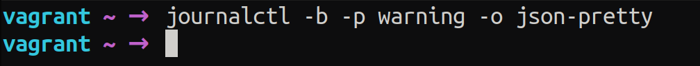

# Exam_2420
Name: Uday Chhina
Student ID: A01210638
Date: Dec 8, 2022

## Answers

### Part 1

```
$ sudo apt update && sudo apt upgrade
```

### Part 2

1. type `:set number` to enable line numbers
2. press `gg` to go to the first line
3. press `w` to go to the next word until the cursor is on `1`. Press `r` to
   replace the character with `0`
4. press `2gg` to move to second line. Press `l` to move to the character 'c'
   and press `a` to append 'h'. Press `esc` to exit insert mode. 
5.Press `e` to go to the next word's until
   the cursor is at `e` in `temparature`. Use `l` to move the cursor to `V`.
   Press `r` to replace `V` with `C`.
6. Press `5gg` to move to the 5th line. Press `r` to replace the `V` with `C`.
7. Press `10gg` to move to the 10th line. Press `w` until the cursor is on the
   `echo`, use `l` to move characcter to the character 'c'. Press `a` to
   append 'h'. Press `esc` to exit insert mode.
8. Press a combination of `w`s and `l`s until at the 'numbs' in the `sed`
   command. Press `R` to replace 'numbs' with ':digi'. Press `esc` to exit
   replacing and press i to insert the rest of the characters to complete
   ':digit:'. 
9, Press `11gg` and press `w` until the cursor is on the `echo`. Press `l` to
   move the cursor to the character 'c'. Press `a` to append 'h'. Press `esc`
   to exit insert mode.
10. You're done. Press `:wq` to save and exit.


### Part 3

1. Open man page with `man journalctl`. 
2. Search with `/` for 'output': `/output` and press n to go to find `-o,
   --output=`. Use `json-pretty` as the output format.


3. Search for 'priority': `/priority` and press n to go to find `-p, it says
   that when a single value is specified it shows logs from lower bvalues
   meaning more important. 


4. Search for 'boot': `/boot` and press n to go to find `-b, --boot` which
   says that when nothing is specified it shows logs for the current boot. 


Unfortunately, there are no logs of warning or higher level for the current
boot.


5. The final command is:


